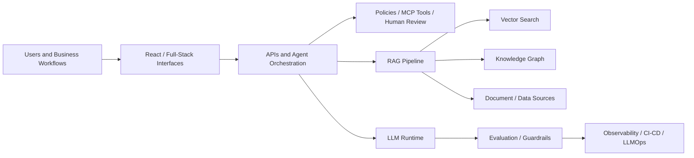

<!--
This README is optimized for a GitHub profile-style landing page.
Important: GitHub only shows a profile README automatically when the repository
name exactly matches the username: PavanSai-Rayalla.
-->

  
  
  
  

  

  
  
  

---

## About Me

I design and ship production AI systems that combine agent orchestration, retrieval, cloud-native infrastructure, and full-stack delivery. My recent work has focused on enterprise-grade agentic AI, corrective and grounded RAG, governed tool integrations with MCP, and AI platforms that can survive real-world compliance, scale, and audit requirements.

Most of my highest-impact work is inside enterprise environments and is not public. This profile highlights the architecture patterns, technical depth, and public experiments that best represent how I build.

> If you want this README to appear at the top of your GitHub profile, the repository name must be exactly `PavanSai-Rayalla`.

### What I Build

| Area | What that looks like in practice |
| --- | --- |
| Agentic AI platforms | LangGraph and LangChain systems, MCP integrations, policy gates, evaluation pipelines, and human-in-the-loop workflows |
| Enterprise RAG systems | Grounded retrieval with Pinecone, FAISS, Azure AI Search, Neo4j, knowledge graph enrichment, and measurable answer quality controls |
| Full-stack AI products | React frontends, Python and .NET services, serverless workflows, secure APIs, and accessible enterprise UX |
| Cloud and data platforms | AWS, Azure, GCP, Databricks, Snowflake, Terraform, Kubernetes, observability, and governed ML and LLM operations |

---

## Impact Snapshot

| Metric | Outcome |
| --- | --- |
| `40%` | Reduced regulatory review cycles with multi-agent workflow automation at UBS |
| `99.95%` | Platform availability achieved within 60 days of launch for a regulatory automation platform |
| `65%` | Reduction in manual pre-processing via structured evidence extraction pipelines |
| `35%` | Improvement in grounding quality by combining vector retrieval with Neo4j knowledge graph relationships |
| `25-40%` | Faster clinical knowledge access for healthcare staff through retrieval-backed AI assistance |
| `45%` | Reduction in manual insurance claims processing through ML-driven automation |

---

## Architecture Lens

---

## Tech I Use In Production

### Languages and Full-Stack

  

### AI, Data, and Platform

  
  
  
  
  
  
  
  
  
  
  
  

---

## Career Highlights

  
<strong>UBS | Senior AI/ML Engineer | October 2023 - Present</strong>

- Built multi-agent regulatory workflows with LangGraph and LangChain, cutting manual review cycles by 40 percent.
- Established evaluation frameworks using golden datasets, RAGAS groundedness and faithfulness scoring, regression gates, and rollback criteria.
- Implemented governed MCP integrations and early A2A connectivity patterns for trusted enterprise agent collaboration.
- Delivered full-stack AI applications using React, Python, .NET, Azure Functions, Azure SQL, and Cosmos DB.
- Drove AKS, Terraform, observability, Azure OpenAI, Azure AI Foundry, Databricks, and Snowflake adoption across production AI services.

  
<strong>Banner Health | Senior AI & ML Engineer | June 2022 - September 2023</strong>

- Built a clinical knowledge assistant that reduced time-to-find critical information by 25 to 40 percent.
- Designed retrieval-first healthcare AI with FAISS, semantic search, provenance, explainability, and quality gates.
- Worked with FHIR, HL7, ICD-10, and SNOMED CT-aligned clinical data and HIPAA/PHI controls.
- Deployed ML and NLP APIs on AWS SageMaker, FastAPI, and Flask with CloudWatch-based monitoring and runbooks.

  
<strong>BCS Financial | Senior Machine Learning Engineer | July 2021 - May 2022</strong>

- Delivered claims processing automation that reduced manual effort by 45 percent.
- Built fraud detection with XGBoost, isolation forest, SMOTE, and MLflow-based experiment tracking.
- Developed OCR and spaCy-based document pipelines and Snowflake-backed compliance reporting.

  
<strong>Kroger | Senior Data Scientist | October 2019 - June 2021</strong>

- Improved promotional ROI by 18 percent with price and promotion optimization on a 60 million household loyalty dataset.
- Increased campaign conversion rates by 22 percent using customer propensity and segmentation models.
- Improved forecast accuracy by 28 percent with demand forecasting models and data pipelines across 2,800 plus stores.

  
<strong>Elind Computers | Data Scientist | July 2015 - May 2019</strong>

- Built Kafka-based ingestion pipelines sustaining 500K plus events per second.
- Optimized PySpark and Spark SQL workflows to reduce execution time by 45 percent.
- Delivered churn prediction models using scikit-learn and Spark MLlib with 88 percent accuracy.

---

## Certifications and Focus Areas

  
  
  
  
  

---

## Selected Public Work

| Project | Description |
| --- | --- |
| [knowledge_graph_rag](https://github.com/PavanSai-Rayalla/knowledge_graph_rag) | Local-first evidence graph RAG app using Neo4j and explicit evidence references |
| [PavanSai-Rayalla](https://github.com/PavanSai-Rayalla/PavanSai-Rayalla) | My GitHub profile repository, custom README, and profile automation setup |

---

## GitHub Activity

  
  

  

  <picture>
    <source media="(prefers-color-scheme: dark)" srcset="https://raw.githubusercontent.com/PavanSai-Rayalla/PavanSai-Rayalla/output/github-contribution-grid-snake-dark.svg" />
    <source media="(prefers-color-scheme: light)" srcset="https://raw.githubusercontent.com/PavanSai-Rayalla/PavanSai-Rayalla/output/github-contribution-grid-snake.svg" />
    
  </picture>

---

## Open To

- Senior AI/ML Engineering
- Agentic AI and GenAI platform engineering
- Enterprise RAG and LLMOps
- Full-stack AI product development
- Cloud-native AI architecture

