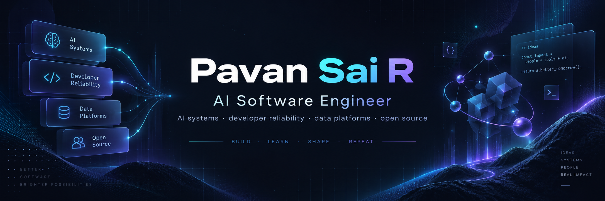
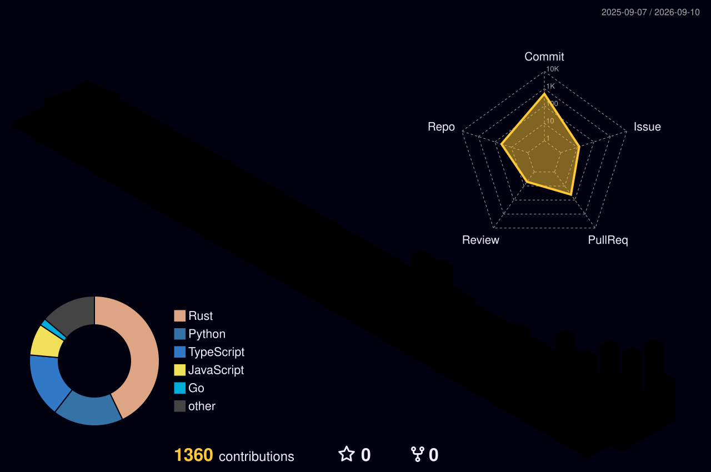

  

  

  
  
  
   
  

## Snapshot

  
  
  
  
  

  
  
  

Pair Extraordinaire · Pull Shark ×2 · Quickdraw

## Selected work

Four disciplines, one habit: turn "looks right" into something you can prove.  release &amp; quality engineering ·  AI &amp; knowledge systems ·  data &amp; platforms ·  shipped products.

<table>
<tr>
<td width="50%" valign="top">

### [ReleaseTruth](https://github.com/PSR94/ReleaseTruth)
Behavioral compatibility for software releases. Captures observable behavior across surfaces, normalizes noise, fingerprints releases, and gates regressions with deterministic evidence.

 

</td>
<td width="50%" valign="top">

### [WireAssume](https://github.com/PSR94/WireAssume)
Discover what an application actually assumes about upstream APIs. Record → replay → mutate → observe → minimize → infer → compare with OpenAPI.

 

</td>
</tr>
<tr>
<td width="50%" valign="top">

### [DecomProof](https://github.com/PSR94/DecomProof)
Evidence-backed software decommissioning. Combines static and runtime signals into deterministic retirement proofs instead of hand-wavy "looks unused" decisions.

 

</td>
<td width="50%" valign="top">

### [VANGUARD](https://github.com/PSR94/VANGUARD)
AI release intelligence and PR risk copilot. Risk scoring, blast-radius analysis, CI/test diagnostics, policy gates, approvals, and release readiness.

 

</td>
</tr>
<tr>
<td width="50%" valign="top">

### [ContextMesh](https://github.com/PSR94/ContextMesh)
Private knowledge intelligence platform. Hybrid dense/sparse/graph retrieval, explicit planning, reranking, grounded answers, traces, evals, and tenant-aware access.

 

</td>
<td width="50%" valign="top">

### [FabricShift](https://github.com/PSR94/fabricshift)
Microsoft Fabric migration readiness and execution planning. Target mapping, reconciliation, lineage, migration waves, and modernization workflows.

 

</td>
</tr>
</table>

<strong>More systems I've built</strong>

 

| Category | Projects |
|---|---|
|  | [ORION](https://github.com/PSR94/ORION) · [CALLSIGNAL](https://github.com/PSR94/CALLSIGNAL) · [ARGUS](https://github.com/PSR94/ARGUS) |
|  | [CITADEL](https://github.com/PSR94/citadel) · [Evidence Graph RAG](https://github.com/PSR94/knowledge_graph_rag) |
|  | [HELIOS](https://github.com/PSR94/helios) · [FabricShift](https://github.com/PSR94/fabricshift) |
|  | [Chaintrail](https://github.com/PSR94/chaintrail) · [Schemafence](https://github.com/PSR94/schemafence) · [ReleaseTruth](https://github.com/PSR94/ReleaseTruth) · [WireAssume](https://github.com/PSR94/WireAssume) · [DecomProof](https://github.com/PSR94/DecomProof) |
|  | [TransitionIQ](https://github.com/PSR94/TransitionIQ) · [ResumeTailor](https://github.com/PSR94/resume-tailor) |

## Open source

Small, reviewable fixes that improve correctness, compatibility, tests, docs, or developer experience in real projects.

| Project | Contribution | Focus |
|---|---|---|
| **Mumble** | [TLS 1.3 cipher configuration](https://github.com/mumble-voip/mumble/pull/7309) |  |
| **Bifrost** | [required nullable response fields](https://github.com/maximhq/bifrost/pull/6723) |  |
| **Bifrost** | [`count_tokens` routing guard](https://github.com/maximhq/bifrost/pull/6762) |  |
| **isort** | [trailing-comma layout for reexports](https://github.com/PyCQA/isort/pull/2605) |  |
| **CodeCarbon** | [raise on unsuccessful API responses](https://github.com/mlco2/codecarbon/pull/1288) |  |
| **Semantic Kernel** | [honor explicit `None` defaults](https://github.com/microsoft/semantic-kernel/pull/14145) |  |
| **Vertex AI Python SDK** | [agent eval normalization](https://github.com/googleapis/python-aiplatform/pull/6984) |  |
| **Vertex AI Python SDK** | [credential defaults](https://github.com/googleapis/python-aiplatform/pull/6983) |  |
| **Vertex AI Python SDK** | [prompt metadata](https://github.com/googleapis/python-aiplatform/pull/6975) |  |
| **vLLM** | [parallel sampling tests](https://github.com/vllm-project/vllm/pull/48062) |  |
| **vLLM** | [ModelOpt docs](https://github.com/vllm-project/vllm/pull/48063) |  |
| **Pydantic** | [contributor setup fix](https://github.com/pydantic/pydantic/pull/13435) |  |
| **Altair GraphQL** | [deeply nested schema types](https://github.com/altair-graphql/altair/pull/3300) |  |
| **ComparIA** | [dataset export workflow](https://github.com/betagouv/ComparIA/pull/596) |  |
| **Kubeflow Pipelines** | [SDK YAPF through make targets](https://github.com/kubeflow/pipelines/pull/13703) |  |

<a href="https://github.com/search?q=is%3Apr+author%3APSR94&type=pullrequests"><strong>All authored pull requests →</strong></a>

## Stack

**Languages & runtimes**

**Frameworks & data stores**

**Cloud & operations**

**AI & data platforms**

## Contribution landscape

<picture>
  <source media="(prefers-color-scheme: dark)" srcset="./profile-3d-contrib/profile-night-rainbow.svg" />
  <source media="(prefers-color-scheme: light)" srcset="./profile-3d-contrib/profile-season-animate.svg" />
  
</picture>

Generated daily from GitHub activity by this profile repository. The light/dark image selection uses GitHub's supported responsive <code>&lt;picture&gt;</code> pattern.

## How I build

> Ground truth before generated confidence. I prefer explicit evidence, deterministic checks, observable workflows, reviewable automation, and AI that explains evidence rather than replacing it.

measure → understand → automate → verify → ship → learn

  <a href="https://github.com/PSR94?tab=repositories">Repositories</a> ·
  <a href="https://github.com/search?q=is%3Apr+author%3APSR94&type=pullrequests">Open-source PRs</a> ·
  <a href="https://psr94.github.io/ai-engineer-roadmap-custom/">AI Engineer Roadmap</a>

